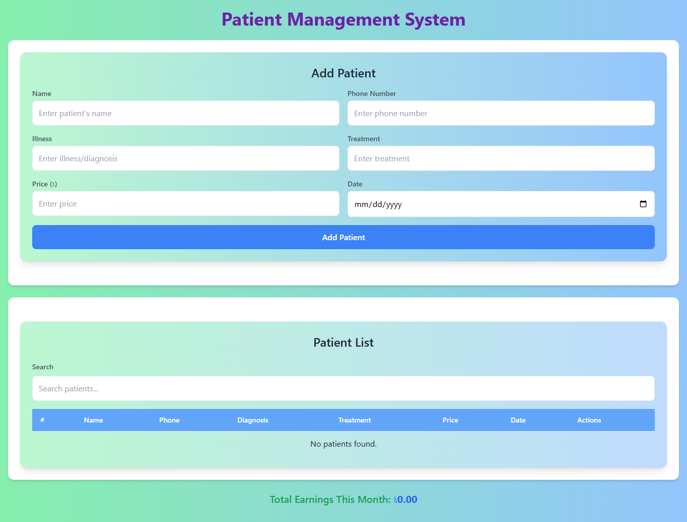

# Patient Management System

A simple and user-friendly Patient Management System built with React. This application allows users to manage patient records, including adding, filtering, and deleting patients, along with calculating total earnings from treatments.

## Table of Contents

- [Features](#features)
- [Screenshots](#screenshots)
- [Technologies Used](#technologies-used)
- [Installation](#installation)
- [Usage](#usage)
- [Contributing](#contributing)
- [License](#license)

## Features

- Add new patient records with details such as name, phone number, diagnosis, treatment, price, and date.
- Filter patient records based on name, phone number, diagnosis, treatment, or price.
- View a list of all patients with options to delete records.
- Calculate and display total earnings for the current month.

## Screenshots



_Replace the above image path with the actual path of your screenshot._

## Technologies Used

- React.js
- JavaScript
- CSS
- Local Storage for data persistence

## Installation

1. Clone the repository:
   ```bash
   git clone https://github.com/yourusername/patient-management-system.git
   ```
2. Navigate to the project directory:
   ```bash
   cd patient-management-system
   ```
3. Install the necessary dependencies:
   ```bash
   npm install
   ```

## Usage

1. Start the application:
   ```bash
   npm start
   ```
2. Open your browser and navigate to `http://localhost:3000`.

3. Use the form to add a new patient, and the patient list will update automatically.
4. Utilize the filter input to search through the patient records.
5. Delete any unwanted patient records directly from the list.
6. View the total earnings displayed at the bottom of the app.

## Contributing

Contributions are welcome! If you have suggestions or improvements, feel free to create a pull request or open an issue.

## License

This project is licensed under the MIT License - see the [LICENSE](LICENSE) file for details.
